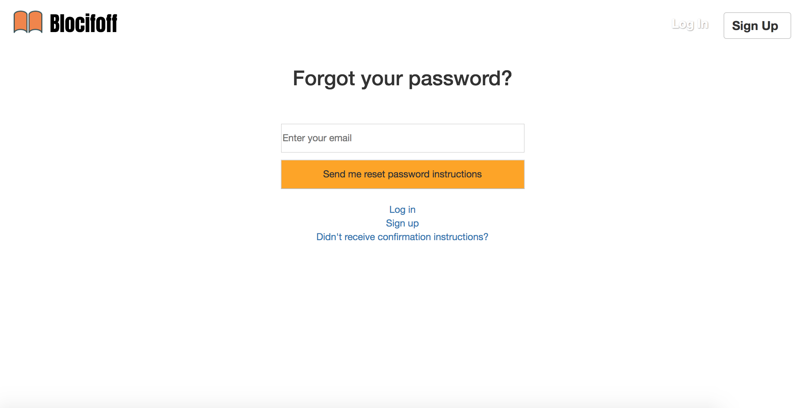
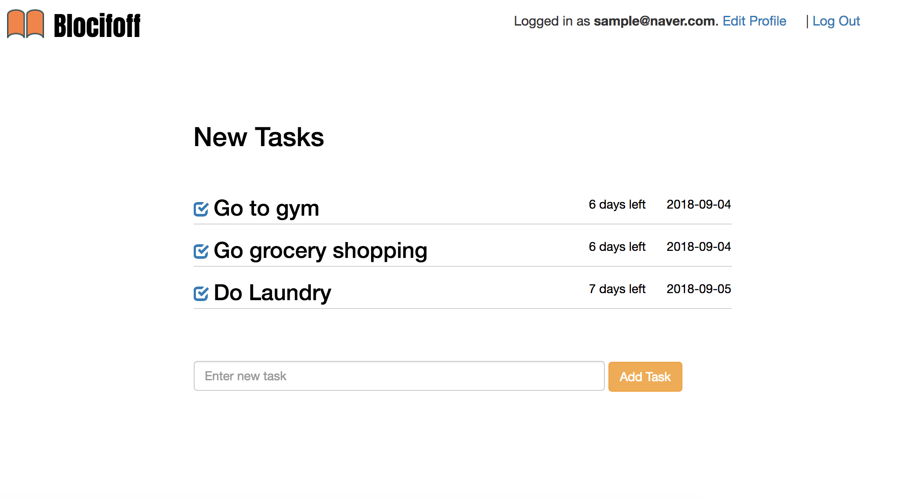

# Blocitoff

Blocitoff is a self destructing task manager. Users can create and delete task items, and delete them as they finish. Items automatically delete after seven days via Rake automation.

The app is deployed on Heroku: https://tranquil-spire-92342.herokuapp.com

The source code is here on GitHub: https://github.com/summerlove91/blocitoff

# Features

+ Users can create a standard account in order to create, edit and delete items.
+ After seven days an automated rake scheduler will parse all current items. Any item older than 7 days will be deleted.

# Setup and Configuration

**Languages and Frameworks**: Ruby on Rails and Bootstrap

**Ruby version 2.4.0**

**Databases**: SQLite (Test, Development), PostgreSQL (Production)

**Development Tools and Gems include**:

+ Devise for authentication

**Setup:**

+ Environment variables were set using Figaro and are stored in config/application.yml (ignored by git).

+ The config/application.example.yml file illustrates how environment variables should be stored.

**To run Blocitoff locally:**

+ Clone the repository
+ Run bundle install
+ Create and migrate the SQLite database with `rake db:create` and `rake db:migrate`
+ Start the server using `rails server`
+ Run the app on `localhost:3000`
